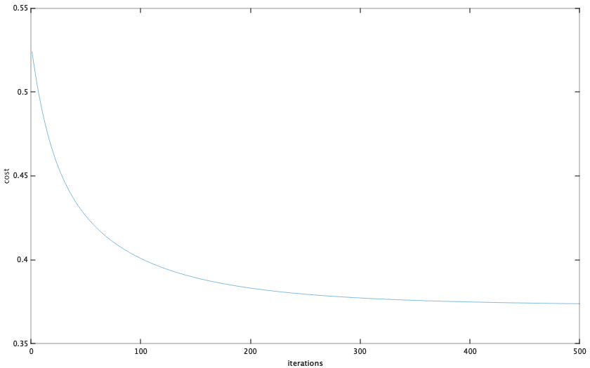
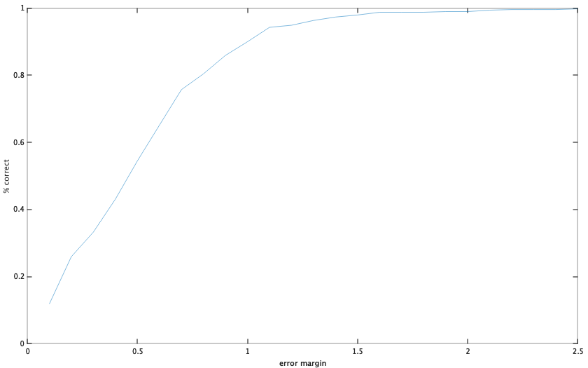

# Pattern Recognition - Assignment 1

Morten D. Laursen

Student id: a0197363

**This is the first assignment in the course Pattern Recognition, Adv.**

### Purpose

In the following assignment I will use regression analysis to try to predict the quality of a bottle of white wine. The code in the following assignment is written in octave. 

### Data

The dataset can be found here: https://archive.ics.uci.edu/ml/datasets/Wine+Quality

The dataset consists of 4898 rows, each corresponding to a different wine. Each row is composed of 12 attributes (columns) which all contain a numerical value. The attributes are as follows: fixed acidity; volatile acidity; citric acid; residual sugar; chlorides; free sulfur dioxide; total sulfur dioxide; density; pH; sulphates; alcohol; quality. The first eleven are independant variables and the last, quality, is the denpendant variable, which I will try to predict using linear regression.

This is the first 10 rows of the dataset

| fixed acidity | volatile acidity | citric acid | residual sugar | chlorides | free sulfur dioxide | total sulfur dioxide | density | pH   | sulphates | alcohol | quality |
| ------------- | ---------------- | ----------- | -------------- | --------- | ------------------- | -------------------- | ------- | ---- | --------- | ------- | ------- |
| 7             | 0.27             | 0.36        | 20.7           | 0.045     | 45                  | 170                  | 1.001   | 3    | 0.45      | 8.8     | 6       |
| 6.3           | 0.3              | 0.34        | 1.6            | 0.049     | 14                  | 132                  | 0.994   | 3.3  | 0.49      | 9.5     | 6       |
| 8.1           | 0.28             | 0.4         | 6.9            | 0.05      | 30                  | 97                   | 0.9951  | 3.26 | 0.44      | 10.1    | 6       |
| 7.2           | 0.23             | 0.32        | 8.5            | 0.058     | 47                  | 186                  | 0.9956  | 3.19 | 0.4       | 9.9     | 6       |
| 7.2           | 0.23             | 0.32        | 8.5            | 0.058     | 47                  | 186                  | 0.9956  | 3.19 | 0.4       | 9.9     | 6       |
| 8.1           | 0.28             | 0.4         | 6.9            | 0.05      | 30                  | 97                   | 0.9951  | 3.26 | 0.44      | 10.1    | 6       |
| 6.2           | 0.32             | 0.16        | 7              | 0.045     | 30                  | 136                  | 0.9949  | 3.18 | 0.47      | 9.6     | 6       |
| 7             | 0.27             | 0.36        | 20.7           | 0.045     | 45                  | 170                  | 1.001   | 3    | 0.45      | 8.8     | 6       |
| 6.3           | 0.3              | 0.34        | 1.6            | 0.049     | 14                  | 132                  | 0.994   | 3.3  | 0.49      | 9.5     | 6       |
| 8.1           | 0.22             | 0.43        | 1.5            | 0.044     | 28                  | 129                  | 0.9938  | 3.22 | 0.45      | 11      | 6       |

### Approach

Loading of data

```octave
data = dlmread("winequality-white.csv",";",1,0);
```

Splitting of data: Data will be split in training data, validation data and test data in the ratio 0.8, 0.1, 0.1

```octave
function [train_data, val_data, test_data] = splitData(data)
	% split data in .8, .1, .1
	N = length(data);
	train_data = data(1:N/10*8, :);
	val_data = data(length(train_data)+1:N/10*9, :);
	test_data = data(length(train_data)+length(val_data)+1:N, :);
endfunction
```

*Note that the validation dataset will not be used in this assignment, due to us not comparing different models or changing hyperparameters.* 

And then the denpendant variable is split from the training data

```octave
function [X, y] = sepXY(data)
	X = data(:,1:size(data, 2)-1);
	y = data(:, size(data,2));
endfunction
```

Now that the data is separated, we want to scale our features, because they are in quite different numerical values. We do this by using the following vectorized formula:
$$
X_{norm}= \frac{X - mean(X)}{std(X)}
$$
where the mean and the standard deviation is computed for each column and then returned as a row vector. In octave the normalization is looks like the following:

```octave
function [X_norm mu sigma] = featureNormalize(X)
	mu = mean(X);
	sigma = std(X);
	X_norm = (X - mu) ./ sigma; %% note that the './' means element by element division
end
```

*Note that it's important to return mu (mean) and sigma (std) as well, because we have to use this later when testing data. When testing data we want to normalize the data using the same mean and standard deviation that our training data has been scaled with.*

Now the data is prepared and we can continue with our regression.

Because we are doing linear regression, we want to get a function of the following form:
$$
y(x, \theta) = \theta_0 + \theta_1x_1+\theta_2+x_2+ \dots + \theta_Dx_D
$$

where x is a matrix of independant variables (or features), w is our weights (or $$\theta$$) and D is number of dimensions (features)

To vectorize this function, we add a column in the beginning of our X consisting of ones. The equation above will stay the samme because $$w_0*1 = w_0$$. 

```octave
X = [ones(N_td,1), X];
```

Our $$\theta$$ is then initlized to a column vector of 0's corresponding to the number of dimensions + 1

```octave 
theta = zeros(size(X,2),1);
```

Next we want to set $$\theta$$ so that our error function is minimized (and thus finding the maximum likelihood). This is called *Least Squares* and is defined as
$$
cost(\theta) = \frac{1}{2}\sum_{n=1}^{N}(h_\theta(x_n)-y_n)^2
$$
where $$h_\theta$$ is our hypothesus corresponding to the function $$y(x, w)$$. This is also known as computation cost:

```octave
function cost = calcCost(X, y, theta, N)
	% Hypothesis is defined by h_theta(x) = X*theta
	H = X*theta;
	% The cost function is defined as 1/2N*sum((H-y)^2)
	cost = sum((H-y) .^2)/(2*N);
endfunction;
```

Next the *Gradient Descent* algorithm is used to find the minimal cost, error and thus finding the optimal theta values. Gradient decent runs a number of iterations until the cost converges in it's mimimum. It does so by changing theta in each iteration, and then calculating the cost. 

Theta is updated by the following rule
$$
\theta=\theta -\alpha\frac{1}{m}\sum_{n=1}^N(h_\theta(x_n)-y_n)*x_i
$$
where alpha is a constant known as learning rate. This is easily vectorized 
$$
\theta = \theta - \alpha*\frac{1}{m}*((X\theta - y)'*X)'
$$
This updates all values of theta simoultaniously before continueing to the next iteration. 

The gradient descent algorithm thus looks like this

```octave
function [theta, his] = gradientDescent(X, y, theta, alpha, N, it)
	his = zeros(it, 1);
	for i = 1 : it
		theta = theta - alpha * (1/N) * (((X*theta) - y)' * X)';
	end
endfunction
```

The alpha and the number of iterations is found in this case by trial and error by visualizing the cost as a function of iterations to make sure it converges. The alpha and the number of iterations are set to 0.01 and 500 respectively. 



And thus our final theta is found.

To test our results, we use the test set of our dataset. Like before the quality-parameter is stripped from the test set. And to make sure we get the correct results, this data is normalized by using the mean and the standard deviation, that we got from our training set.

```octave
function X_norm = featureNormWithExisting(X, mu, sigma)
	X_norm = (X - mu) ./ sigma;
endfunction
```

and to test our predictions, we run these with a different error margin ranging from 0.1 to 2.5 (*note that the quality is a rating from 1-10*)

```octave
function errors = testData(test_data, mu, sigma, theta)
	X_test = test_data(:,1:size(test_data, 2)-1);
	X_test = featureNormWithExisting(X_test, mu, sigma);
	X_test = [ones(length(X_test),1), X_test];
	y_test = test_data(:, size(test_data,2));
	res = ones(length(X_test),2);
	errors = ones(25,2);
	for j = 1 : 25
		errormargin = j/10;
		correct = 0;
		for i = 1 : length(X_test)
			predicted = sum(X_test(i,:)' .*theta);
			res(i, 1) = predicted;
			res(i, 2) = y_test(i);
			if (predicted <= y_test(i)+errormargin && predicted >= y_test(i)-errormargin)
				correct++;
			end
		end
		fprintf('With an error margin of %.2f, the correct results are %.2f percent\n', errormargin, correct/length(X_test)*100);
		errors(j,1) = errormargin;
		errors(j,2) = correct/length(X_test);
	end
endfunction
```

### Results

theta =

   5.84140613
  -0.03773801
  -0.17214952
   0.00074982
   0.17639911
  -0.03158767
   0.10082043
  -0.03173915
  -0.13282769
   0.05164767
   0.06685461
   0.38001813

Predictions: 

| Error margin | Percent correct |
| ------------ | --------------- |
| 0.10         | 11.84           |
| 0.20         | 25.92           |
| 0.30         | 33.27           |
| 0.40         | 43.06           |
| 0.50         | 54.49           |
| 0.60         | 65.10           |
| 0.70         | 75.71           |
| 0.80         | 80.41           |
| 0.90         | 85.92           |
| 1.00         | 90.00           |
| 1.10         | 94.29           |
| 1.20         | 94.90           |
| 1.30         | 96.33           |
| 1.40         | 97.35           |
| 1.50         | 97.96           |
| 1.60         | 98.78           |
| 1.70         | 98.78           |
| 1.80         | 98.78           |
| 1.90         | 98.98           |
| 2.00         | 98.98           |
| 2.10         | 99.39           |
| 2.20         | 99.59           |
| 2.30         | 99.59           |
| 2.40         | 99.59           |
| 2.50         | 99.80           |

And visualized:



To check how well our prediction function fits the data, we compute the $$R^2$$ using the following formular:

```octave
function R2 = computeRSquared(y, predictions)
	SS_tot = sum((y-mean(y)).^2);
	SS_res = sum((y-predictions).^2);
	R2 = 1-(SS_res/SS_tot);
endfunction
```

which gives a poor result of only $$R^2=0.29$$ , so the prediction function is not very precise. 

### Discussion

As the above shows, the prediction function is not really precise, but can still be used within a certain margin. For instance if we are okay with an error margin of $$\pm 1$$ we will have a prediction success of 90.00%. 

As an alternative to the above approach, we could also have done it, using the normal equation. The advantages using the normal equation is, that we don't have to choose alpha and we don't need to iterate, so this should give us a slightly better fit. The disadvantages is, that it computational expensive. Where gradient descent has a running time of $$O(kn^2)$$ the normal equation approach has a running time of $$O(n)=n^3$$ because we need to calcualte the inverse of $$X^TX$$. This means that the normal equation would work bad, when n (amount of rows) is very large. But in our example it should be fine, so we can compare these to approaches.

```octave
% lets try with the normal normal equation
XN = sepXY(train_data); %We separate X and y from the original training data
XN = [ones(length(y),1) XN]; % again we add ones
thetaN = normalEquation(XN, y); % then we find theta
fprintf('2nd order poly (NE): R^2 = %.4f\n', computeRSquared(y, XN*thetaN)); %and compute R squared
```

where the *normalEquation* function looks like this

```octave
function theta = normalEquation(X, y)
	theta = pinv(X'*X)*X'*y;
endfunction
```

where *pinv()* returns the Moore-Penrose pseudoinverse of X.

As expected this gives us a better fit, when computing R-squared: $$R^2=0.2993$$, because we don't have to set alpha manually. As this is just slightly better (and assuming the theta computed by the normal equation is correct), it's concluded that our approach above is correct. 

Both of the success rates are rather low, but keep in my this is a linear regression. The results might be much better if we used polynomial regression, but that is out of scope for this assignment.  

