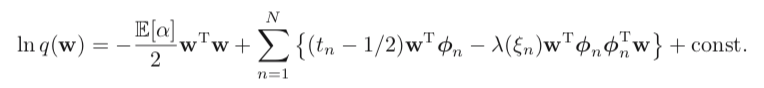

# Pattern Recognition, Adv. - Assignment 4

Name: Morten D. Laursen

Student id: a0197363

## ML estimation

### Derivative of the formulas on slide 22

By assuming that $Z$ is a set of hidden continuous variables, we have the following equation:
$$
log(p(X;\theta)) = log \int p(X,Z;\theta)dz
$$
which by introducing an arbitrary distribution $q(Z)$ (called a variational distribution) transforms to this
$$
log(p(X;\theta)) = log \int q(Z) \frac{p(X,Z;\theta)}{q(Z)}dz
$$
which by Jensen's inequality is equal to:
$$
log(p(X;\theta)) \geq  \int q(Z) \frac{p(X,Z;\theta)}{q(Z)}dz
$$
when it's true that $q^*(Z)  = p(Z|X;\theta)$ (which is the expectation-step of the algorithm). And thus by rearranging we get
$$
log(p(X;\theta)) = \int q(Z)log(p(X,Z;\theta))dz-\int q(Z)log(q(Z))
$$
and because the max of $\theta$ is found when the second term vanishes, the lower bound is equal to the log likelihood, and thus the derivations will only focus on the first term.

For easier readability we assume that $Z$ is a set of hidden *discrete* values, and thus the summation will be used instead of the integral, and thus we have log maximum likelihood:
$$
ln(p(X|\pi, \mu, \Sigma)) = \sum_{n=1}^Nln \left ( \sum_{k=1}^K\pi_k \mathcal{N}(x_n|\mu_k, \Sigma_k)  \right)
$$
where $X$ is the observed data, $\pi$ is the mixing ratio (also known as the prior), $\mu$ is the mean, $\Sigma$ is the covariance, $N$ is the amount of observations, $K$ is the dimensionality of the observations and $\mathcal{N}$ denotes the normal distribution with $\mu$ and $\Sigma$. 

#### Mean

By setting the derivative of equation (5) with regards to $\mu$, and setting this to 0, we obtain the follow equation by utilizing equation 394 from The Matrix Cookbook [https://www.math.uwaterloo.ca/~hwolkowi/matrixcookbook.pdf](https://www.math.uwaterloo.ca/~hwolkowi/matrixcookbook.pdf) and reearanging:
$$
- \sum_{n=1}^N \frac{\pi_k \mathcal{N}(x_n|\mu_k,\Sigma_k)}{\Sigma_j\pi_j\mathcal{N}(x_n|\mu_j)}\Sigma_k(x_n-\mu_k) = 0
$$
and when summing over the term $\Sigma_j\pi_j \mathcal{N}(x_n|\mu_j)$ this is equal to the corresponding posteriors, for each observed value, also denoted by $\gamma(z_{nk})$, we have:
$$
- \sum_{n=1}^N \frac{\pi_k \mathcal{N}(x_n|\mu_k,\Sigma_k)}{\gamma(z_{nk})}\Sigma_k(x_n-\mu_k) = 0
$$
By rearranging we get:
$$
\mu_k = \frac{\sum_{n=1}^N \gamma(z_{nk})x_n}{\sum_{n=1}^N \gamma(z_{nk})}
$$
and by the equations on slide 22, we have:

$$
S_k[1] = \sum_{n=1}^N\gamma_{nk}
$$

$$
S_k[x]=\sum_{n=1}^N\gamma_{nk}x_n
$$

$$
S_k[xx^\intercal]=\sum_{n=1}^N\gamma_{nk}x_nx_n^\intercal
$$
and
$$
\mu_k^*=\frac{S_k[x]}{S_k[1]}
$$
Substituting equation 9 and 10 into 12, equation 12 is equal to equation 8, and thus the equation on the slide is proved and
$$
\mu_k = \mu_k^*
$$


#### Variance

By the same approach as above, and setting the derivative of equation 5, with regards to $\Sigma$ and by utilizing equation 396 on the [matrix cookbook](https://www.math.uwaterloo.ca/~hwolkowi/matrixcookbook.pdf) we obtain and rearranging we get
$$
\Sigma_k = \frac{\sum_{n=1}^N \gamma(z_{nk})(x_n-\mu_k)(x_n-\mu_k)^\intercal} {\sum_{n=1}^N \gamma(z_{nk})}
$$
and by moving $\mu$ outside the parenthesis, we get:
$$
\Sigma_k = \frac{\sum_{n=1}^N \gamma(z_{nk})(x_n)(x_n)^\intercal} {\sum_{n=1}^N \gamma(z_{nk})}-\mu_k\mu_k^\intercal
$$


and on slide 22, we have
$$
\Lambda_k^{-1^{*}}=\frac{S_k[xx^\intercal]}{S_k[1]}-\mu_k\mu_k^\intercal
$$
and by substituting equation 9 and 11 into 16, equation 15 is equal to equation 16, and thus the equation on the slide is proved and
$$
\Sigma_k=\Lambda_k^{-1^*}
$$


#### Mixing ratio

When maximizing equation 5, which regards to the mixing ratio, we again use the matrix cookbook and this time equation 392 and we get
$$
\pi_k = \frac{\sum_{n=1}^N \gamma(z_{nk})} {\sum_{n=1}^N \gamma(z_{nk})\pi_j}
$$
And because we have a constraint that $\pi$ must sum to 1, the denominator collapses to $N$:
$$
\pi_k = \frac{\sum_{n=1}^N \gamma(z_{nk})} {N}
$$


And thus the mixing ratio is calculated by taking the mean of each class. From slide 22, we have
$$
\pi_k^*=\frac{S_k[1]}{S.[1]}
$$
by substituting equation 9 into 20, we and by $S.[1] = N$, we have proved the equation on the slide and
$$
\pi_k = \pi_k^*
$$


### Implementation of EM

#### Initialization

Assuming we have a dataset consisting of $N$ observations generated by a Gaussian Distribution, we initialize size $N$, by taking the number of observations. We initialize $\mu$ with two random observations (in my implementation, we pick the first 2). $\Sigma$ is initialized by assigning $\Sigma\{k\}$ to the covariance of the entire dataset for each cluster. And then we set the priors $\pi$ to be $0.5,\ 0.5$, by assuming that half of the points will belong to the first cluster and vice versa. 

```octave
% -------------------
% initialization
% -------------------
X = csvread('x.csv');

% Set initial parameters
N = size(X,1); % Total number of observations
D = size(X,2); % Dimensions
K = 2; % Number of classes i want to sort the data into.


% Initialize the covariance matrix for each cluster to be equal to the covariance of the full data set
% Also Initialize mu to be the two first points in X
sigma = [];
mu = [];
for k = 1:K
   sigma{k} = cov(X);
   mu{k} = X(k,:);
end

%I Initlize the prior probability for each data point. We are assuming that the probability is equal
% prior = [.5 .5];
prior = (ones(K,1) * (1 / K));

% delete files. This is done to make sure that the files are created fresh everytime we run the algorithm.
delete("out/em/w.csv");
delete("out/em/prior.csv");
delete("out/em/sigma.csv");
delete("out/em/mu.csv");
```

Next we have our estimation step

#### Estimation step

We begin by initializing our $\theta$ (denoted by w, in the code and will be known as *weights* in the following). After this we compute the probability distribution for each cluster, by taking the current mean $\mu$ and the current covariance $\Sigma$ of the particular cluster, that we are working with. Afterwards we multiply each value by our prior $\pi$ to get our posterior, and we end up by normalizing our posterior, so that we'll get a value between 0 and 1, that sums up to 1 for each observation regarding which cluster it belongs to. 

```octave
% -------------------
% e-step!
% -------------------
function w = eStep(X, N, K, mu, sigma, prior, D)
	% initlize w, which is the matrix, that contains the probabilities for each data point, to be in cluster 1 or 2.
	% That means it should be a N x K matrix. N data points and K clusters.
	w = zeros(N, K);
	% calculate the probability for each datapoint, given the the current mu and the current covariance assigned to each cluster. In first iteration the mu's are different, but the covariance are the same. We have to do this for each cluster.
	for k=1:K
		w(:,k) = pdfGaussian(X, mu{k}, sigma{k}, D);
	end
	%multiple each value with the prior
	w = w.*prior';
	% normalizing -> makes w sum to 1.
	w = w ./ sum(w,2);
	% done!
endfunction
```

the `pdfGaussian`-function looks as this:

```octave
function pdf = pdfGaussian(X, mu, sigma, D)
	% To make it eassier, we subtract the mean from each datapoint in X immediately
	Xm = X-mu;
	pdf = exp(-0.5 * sum((Xm) * inv(sigma) .* (Xm),2)) / sqrt((2*pi)^D * det(sigma));
endfunction
```

and utilizes that the form of the gaussian is:
$$
g_j(x)=\frac{1}{\sqrt{(2\pi)^n|{\Sigma_j|}}}e^{-\frac{1}{2}(x-\mu_j)^\intercal\Sigma_j^{-1}(x-\mu_j)}
$$

#### Maximization step

In the maximization step we run through each cluster, and calculates the parameters derived in the previous section.

The new prior $\pi$ is calculated by using the new weights estimated by the estimation step, by taking the sum of each weight-column and dividing it by the total number of observations, $N$.  

$\mu$ is calculated from equation equation 8, by taking each column of the weights (the posterior), multiplying it by the original data $X$ and then dividing each element in the column by the sum of weights.

$\Sigma$ is calculated by getting the contribution to the covariance from each value, and thus is calculated value by value (row by row in each column). We take the current weight, multiply it with the original data minus the current mean squared. When we have run through all the values of the weights, we divide the sigma for each column by the sum of the weights in each column. 

Thus we have:

```octave
% -------------------
% M-step!
% -------------------
function [prior, mu, sigma] = mStep(w, N, K, mu, sigma, X, prior)
	prior = mean(w,1)';
	% Calculate the new means for each of the classes/distributions
	mu_ = (w'*X)'./sum(w,1);
	for k=1:K
	  % update the mean of the class/distribution
	  mu{k} = mu_(:,k)';
	  % update the covariance matrix of the class/distribution
	  X_mu = X - mu{k};
	  X_mu_ = (w(:,k).*X_mu)';
	  sigma{k} = (X_mu_*X_mu) ./ sum(w(:,k));
	end
endfunction
```

#### Putting it all together

When putting is all together we first run our initialization. Then we set an arbitrary number of iterations and checks for convergence by comparing the means after each e- and m-step. 

```octave
for(i = 1 : 1000)
	i
	w = eStep(X, N, K, mu, sigma, prior, D);
	mu_ = mu;
	[prior, mu, sigma] = mStep(w, N, K, mu, sigma, X, prior);

	% writing to files
	csvwrite("out/em/Z_prior.csv", i, "-append");
	csvwrite("out/em/Z_prior.csv", prior', "-append");

	if(converged(mu, mu_, 0.00001))
		f = fopen('out/em/param.dat', 'wt');
		fprintf(f, "mu:\n");
		for j = 1 :  size(mu, 2)
			fprintf(f, '%s ', mat2str(mu{j}));
			fprintf(f, "\n" )
		end
		fprintf(f, "\n\nsigma:\n");
		for j = 1 : size(sigma, 2)
			for k = 1 : size(sigma{j},1)
				fprintf(f, '%s', mat2str(sigma{j}(k,:)));
				fprintf(f, '\n')
			end
			fprintf(f, '\n');
		end
		fprintf(f, "\n\nw:\n")
		for j = 1 : size(w, 1)
			fprintf(f, '%s', mat2str(w(j, :)));
			fprintf(f, '\n');
		end
		fclose(f);
		break;
	end
end
```

And the convergence function, looks like this:

```octave
function converged = converged(mu, mu_, epsilon)
	m_m = [mu_{1};mu_{2}];
	mm = [mu{1}; mu{2}];
	converged = all(abs(mm-m_m) <= epsilon);
end
```

When the function has converged we are done.

Find the output of each iteration's prior in the file Z_prior in the folder out/em. Find the end parameters of mu and sigma in the file param.dat in the same folder.  


## Bayesian estimation

### Derivative of the formulas on slide 46

If we start with a the probability of $\alpha$ given by the gamma function of $\alpha$ governed by $a_0$ and $b_0$, we have the following function
$$
p(\alpha) = \text{Gam}(\alpha|a_0, b_0)
$$
The marginal likelihood of equation 23 then looks like this
$$
p(\text{t}) = \int\int p(w, \alpha, t) dw \ d\alpha
$$
which has a joint distribution of
$$
p(w, \alpha, t) = p(t|w)p(w|\alpha)p(\alpha)
$$
This is decomposed into the lower bound and a Kullback-Leibler-function given by this
$$
ln(p(\text{t})) = \mathcal{L}(q) + \text{KL}(q||p)
$$


*Sorry, I ran out of time, so I can't write the complete derivation, but the idea is that from equation 26, we apply local variational bound and use the following inequality*


*which puts a lower bound on $\mathcal{L}(q)$, which also puts a lower bound on the log marginal likelihood. When we have this lower bound, we assume that the variational distribution factorizes between parameters and thus we have*
$$
q(w, \alpha) = q(w)q(\alpha)
$$
*Taking the log of this with respect to $w$, we end up with a function looking like this.* 



*This is a quadratic function of w and thus the solution will be gaussian. Thus by knowing this it is relatively easy to derive the update function on slide 47, by using already known definitions.*

   

### Implementation of VB

#### Initialization

We start by initializing mu to the first $K$ data points, where $K$ is our amount of clusters. Then we initialize the hyper parameters $a$, $b$ and $v$, to a column vector of length $K$ with values 0.1, a single value of 1, and a column vector of length $K$ with values of 4 respectively. Next we initialize our $W0inv$ which is the inverse of our $W$ and then we initialize W as a three stacked vector containing identity matrices.

In the end we run a single maximization step to initialize our parameters, before we can run our iterations. 

```octave
% Set initial parameters
N = size(X, 1); % Total number of observations
D = size(X, 2); % Dimensions
K = 4; % Number of classes i want to sort the data into.


% Initialize mu
mu = zeros(D, K);
m0 = zeros(D, K);
for k = 1 : K
   m0(:, k) = X(k, :);
end
mu = m0;

% Initialize hyperparameters
a0 = 0.1 * ones(K, 1);
a = a0;
b0 = (1)*ones(1, 1);
b = b0;
v0 = (D + 1) * ones(K, 1);
v = v0;

% Initialize rest
W0inv = eye(D);
W = zeros(D, D, K);

for k = 1 : K
    W(:, :, k) = eye(D, D);
end

gamma = zeros(N, K);

% Run one maximization step
[ratio, cov_ , W, mu, a, b, v] = mStep(X, N, K, D, W, W0inv, mu, m0, gamma, a0, b0, v0);

```

#### Estimation step

We follow the approach from Bishop's Pattern Recognition and Machine Learning chapter 10. When the direct formulas from the book are used, these are denoted in the comments. 

```octave
% -------------------
% e-step!
% -------------------
function gamma = eStep(X, N, K, D, W, mu, a, b, v)
	sum_ = ones(K, 1);
	for k = 1 : K
		for i = 1 : D
			sum_(k) = sum_(k) + psi((v(k) + 1 - i) / 2); % used in 10.65 from Bishop
		end
	end
	logrho = ones(N,K);
	gamma = ones(N,K);
	for k = 1 : K
	    for n = 1 : N
	        mu_ = D / b(k) + v(k) * (X(n, :)' - mu(:, k))'*W(:, :, k) * (X(n , :)' - mu(:, k)); % 10.64 from Bishop
	        delta_ = sum_(k) + D * log(2) + log(det(W(:, :, k))); % 10.65 from Bishop
	        phi_ = psi(a(k)) - psi(sum(a)); % 10.66 from Bishop.
	        logrho(n, k) = phi_ + 0.5 * delta_ - (D * log(2 * pi)) / 2 - 0.5 * mu_; % Used in 10.46 From Bishop

	    end
	end
	rho = exp(logrho);
	for n = 1 : N
	    sum_ = 0;
	    for k = 1 : K
			% Update sum_
	        sum_ = sum_ + rho(n, k);
	    end
	    for k = 1 : K
			% Update gamma
	        gamma(n, k) = rho(n, k) / sum_;
	    end
	end
endfunction
```

#### Maximization step

Again we just follow Bishop's approach, and get the following:

```octave
% -------------------
% M-step!
% -------------------
function [ratio, cov_ , W, mu, a, b, v] = mStep(X, N, K, D, W, W0inv, mu, m0, gamma, a0, b0, v0)
	Winv = zeros(D, D, K);
	nk = sum(gamma); % 10.51 from Bishop
	Sx = zeros(D, K);
	for k = 1 : K
        Sx(:, k) = sum(repmat(gamma(:, k), [1, D]) .* X); % 10.52 from Bishop
    end
	Sxx = zeros(D, D, K);
    for k = 1 : K
        m = zeros(D, D);
        for n = 1 : N
            m = m + gamma(n, k) * X(n, :)' * X(n, :); % 10.62 from Bishop
        end
        Sxx(:, :, k) = m;
    end

	% Update parameters
	a = a0 + nk'; % 10.58 from Bishop
	b = b0 * ones(K,1) + nk'; % 10.60 from Bishop
	for k = 1 : K
	    mu(:, k) = (b0 * mu(:, k) + Sx(:, k)) / (b0 + nk(k)); % 10.61 from Bishop
	end
	v = v0 + nk'; % 10.63 From Bishop
	for k = 1 : K
	    Winv(:, :, k) = W0inv + b0 * (m0 * m0') + Sxx(:, :, k) - b(k) * (mu(:, k)*mu(:, k)');
	    W(:, :, k) = inv(Winv(:, :, k));
	end
	%to estimate the lower bound we also need the cov matrices
	cov_ = zeros(D, D, K);

	for k = 1 : K
	    cov_(:, :, k) = Sxx(:, :, k) / nk(k) - mu(:, k) * mu(:, k)';
	end
	ratio = nk / sum(nk);

endfunction
```

#### Putting it together

Putting it all together and running iterations looks like this:

```octave
for i = 1 : 1000
	i
	gamma = eStep(X, N, K, D, W, mu, a, b, v);
	mu_ = mu;
	[ratio, cov_ , W, mu, a, b, v] = mStep(X, N, K, D, W, W0inv, mu, m0, gamma, a0, b0, v0);
	csvwrite("out/vb/Z_gamma.csv", i, "-append");
	csvwrite("out/vb/Z_gamma.csv", gamma', "-append");

	if(converged(mu, mu_, 0.00001))
		f = fopen('out/vb/param.dat', 'wt');
		fprintf(f, "mu:\n");
		for j = 1 :  size(mu, 2)
			fprintf('%s', mat2str(mu(j,:)))
			fprintf(f, "\n" )
		end
		fprintf(f, "\n\a:\n");
		fprintf(f, '%s', mat2str(a));
		fprintf(f, "\n\nb:\n")
		fprintf(f, '%s', mat2str(b));
		fprintf(f, "\n\nv:\n")
		fprintf(f, '%s', mat2str(v));
		fclose(f);
		break;
	end
end
```

The result of the inference algorithm can be seen in the file Z_gamma.csv in the folder out/vb. In the same folder the end values of the parameters can be seen in param.dat

**Note:** Note that in this implementation we are changing the data *line by line*, and with a dataset of just 10.000 observations, this is very slow. The algorithm converges after 15 iterations, but it takes a long time. A better implementation would be to vectorize everything, which would make the computations a lot faster!


## Conclusion

As we can see in this paper the Variation Bayesian Inference algorithm and the expectation maximization algorithm are very similar. They both solve the same problem, and they even use similar update formulas but in two different ways. EM uses the values of the parameters, where Variational Bayes uses the geometric means of the parameters. In practice EM's approach returns a "point", where Variational Bayes returns a distribution, which would be expected. Both algorithms tries to minimize the distance (either trough direct values or geometric distance) between our estimates and the true value. 